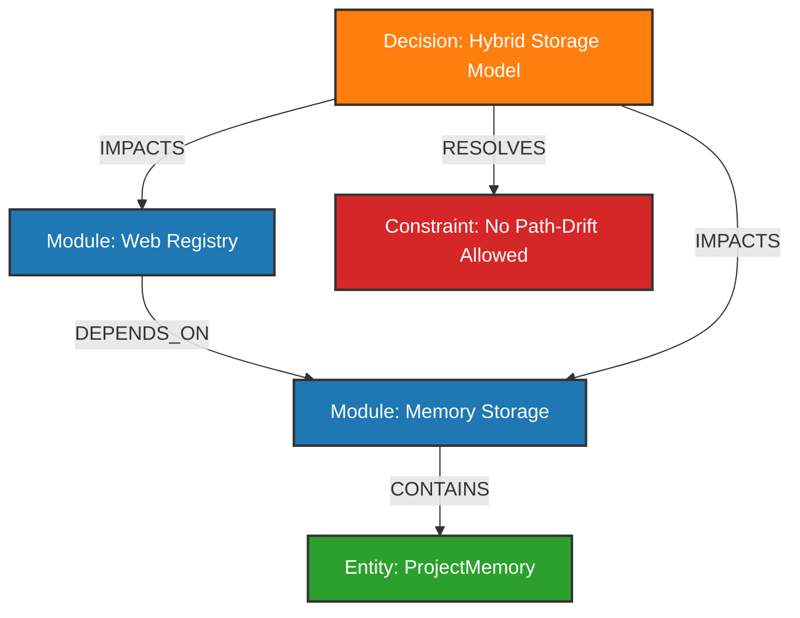

# PURPOSE

Tài liệu này tồn tại để chốt rõ mục tiêu của project, tránh cho người mới vào phải đoán ý đồ từ tên file hay từ các memo rời rạc.

## Mục tiêu cốt lõi
Project này nghiên cứu và thiết kế một hệ memory cho agent theo hướng:
- **nhanh**
- **ổn định**
- **hiệu quả**
- **layer rõ ràng**
- **agent có thể tự truy cứu**
- **không phải nhắc đi nhắc lại**

## Ý tưởng chính
**Single source of truth** cho memory và kiến thức có cấu trúc: dữ liệu phải tồn tại ở đúng **một nơi**, không được có hai bản có thể drift nhau.

Format cụ thể (JSON file, SQLite, Markdown, hay thứ khác) là **implementation choice**, không phải design constraint. Tiêu chí chọn format:
- **Nhanh**: query trả về trong milliseconds, không cần LLM call trên đường đọc
- **Ổn định**: không mất data do restart, path drift, hay rename
- **Chính xác**: không stale, không drift giữa hai representation
- **Single source of truth**: write vào đây, mọi thứ khác là derived

`JSON` là format tốt cho dữ liệu có cấu trúc vì human-readable, git-committable, portable. `SQLite` là wrapper tốt cho JSON records khi cần indexing và query nhanh — không phải hai thứ tách biệt mà là cùng một data với lớp query engine trên top. `Markdown` phù hợp cho tài liệu dài mà con người đọc.

Không được có cùng một fact tồn tại ở cả JSON lẫn Markdown mà không có cơ chế sync — đó là nguồn gốc của drift.

**Ràng buộc lossless (biến đổi 2 chiều):** Mọi format trung gian (YAML file, export) phải đảm bảo:
```
file → smem → file   = không mất thông tin
smem → file → smem   = không mất thông tin
```
Đây là điều kiện để single source of truth thực sự có nghĩa — nếu một chiều mất dữ liệu thì không còn là single source nữa.

`Markdown` vẫn được dùng nếu cần, nhưng không phải là nơi agent phải đọc thẳng theo kiểu dump toàn bộ file dài.
Thay vào đó phải có một **wrapper / proxy / tool layer** ở giữa:
- đọc nguồn thô
- tự scope theo câu hỏi
- tự chunk / filter / extract
- tự nén context
- trả về phần thật sự hữu dụng cho agent

## Hai loại memory
Project này tách memory thành 2 lớp rõ ràng:

### `global`
- Là memory toàn cục.
- Mọi project đều có thể biết về nó.
- Dùng cho tri thức nền, quy ước chung, kiến trúc lõi, pattern đã chốt.

### `local`
- Là memory chỉ nội tại trong một project cụ thể.
- Không được tự ý lẫn sang project khác.
- Dùng cho spec, quyết định cục bộ, trạng thái riêng, ghi chú theo dự án.

## Cơ chế merge memory
Ngoài tách `global/local`, hệ này cần có khả năng merge thông minh giữa các project:

- `projectA` và `projectB` có thể cùng nói về một tư tưởng, một pattern, hoặc một đối tượng.
- Nhưng nội dung ban đầu bị chia mảnh theo từng project.
- Hệ phải có cơ chế gom các phần liên quan lại mà không làm loạn boundary.

### Mục tiêu của merge
- hợp nhất tri thức trùng hoặc gần trùng
- giữ lại provenance và nguồn gốc
- tránh “merge mù” làm mất ngữ cảnh
- cho phép nâng một phần local lên global khi đủ chín

### Merge targets
Merge có thể diễn ra theo nhiều tiêu chí:
- theo **chủ đề**
- theo **đối tượng**
- theo **khái niệm**
- theo **quyết định**
- theo **pattern**
- theo **quy trình**
- theo **relation / graph**

### Wizard merge
Tool không nên tự merge âm thầm.
Nó phải hỏi người dùng bằng wizard để chọn tiêu chí merge.

Wizard cần liệt kê rõ các option, ví dụ:
1. merge theo chủ đề
2. merge theo đối tượng
3. merge theo khái niệm
4. merge theo quyết định
5. merge theo pattern
6. merge theo relation
7. merge local vào global
8. merge local với local giữa nhiều project

### Pipeline merge
1. scan candidate memory từ local/global liên quan
2. nhóm theo tiêu chí đã chọn
3. hiển thị danh sách cụm trùng hoặc gần trùng
4. user chọn cụm nào được merge
5. hệ tạo bản merged record mới
6. lưu provenance của từng nguồn
7. giữ lại bản cũ dưới dạng superseded hoặc alias
8. reload index / web / cache

### Nguyên tắc
- không merge nếu chưa có tiêu chí rõ
- không overwrite thẳng làm mất history
- không phá boundary project nếu chưa được phép
- không đẩy local lên global chỉ vì giống bề mặt
- merge phải là hành động có chủ đích, có thể audit lại

## Đồ thị liên kết vĩ mô (Smart Macro-Graph)

Hầu hết các hệ thống đồ thị tri thức hiện nay gặp phải **vấn nạn đồ thị mạng nhện (Hairball Problem)** do sa đà vào việc ghi nhận các liên kết quá nhỏ (ví dụ: `FunctionA gọi FunctionB`, `FileC import FileD`). Điều này tạo ra hàng ngàn node nhiễu, làm loãng ngữ cảnh và gây quá tải token cho Agent. 

Smart Memory giải quyết vấn đề này bằng cách thiết kế một **Smart Macro-Graph (Đồ thị Liên kết Vĩ mô)** tập trung vào các thực thể và mối quan hệ ở mức cao (High-Level).

### 1. Các loại Node Vĩ mô (Macro-nodes)
Hệ thống chỉ định nghĩa và lưu trữ đồ thị với các nhóm node cốt lõi:
- **Module / Domain Node**: Các phân khu chức năng hoặc dịch vụ lớn (ví dụ: `AuthService`, `BillingModule`, `MemoryRegistry`).
- **Domain Object / Core Entity Node**: Các thực thể nghiệp vụ trung tâm (ví dụ: `User`, `ProjectMemory`, `Invoice`).
- **Decision Node (Quyết định)**: Các quyết định thiết kế lớn ảnh hưởng đến toàn bộ hệ thống hoặc các module cụ thể.
- **Constraint Node (Ràng buộc)**: Các giới hạn kỹ thuật hoặc nghiệp vụ (ví dụ: `LowLatencyRequirement`, `OfflineFirst`).

### 2. Các mối quan hệ Vĩ mô (Macro-relationships)
Thay vì liên kết gọi hàm đơn thuần, đồ thị biểu diễn các tương tác kiến trúc:
- `DEPENDS_ON` (Phụ thuộc cấu trúc giữa các module lớn).
- `COMMUNICATES_VIA` (Phương thức giao tiếp: Event-driven, Sync RPC, Shared Database).
- `CONTAINS` (Quan hệ phân cấp: Module chứa các Entity và các file/class cốt lõi).
- `IMPACTS` (Quyết định thiết kế ở Module A tạo ra ràng buộc hoặc thay đổi hành vi ở Module B).
- `RESOLVES` (Quyết định kiến trúc giải quyết một Constraint cụ thể).



### 3. Cơ chế Duyệt đồ thị Phân cấp (Hierarchical Graph Navigation)
- **Big Picture First (Tổng quan trước)**: Mặc định, khi Agent hoặc Web view truy vấn đồ thị, hệ thống chỉ hiển thị các mối liên kết giữa các Module và Entity lớn để Agent nắm được luồng dữ liệu chính và ranh giới (boundaries) của hệ thống.
- **Lazy Zoom-In (Chi tiết sau)**: Chỉ khi Agent có yêu cầu cụ thể về một mối quan hệ phức tạp (ví dụ: *"Tôi muốn biết chính xác cách Web Registry tương tác với Memory Storage"*), hệ thống mới thực hiện phân giải xuống tầng micro (danh sách API endpoints, Class giao tiếp cốt lõi) tương ứng với cạnh `DEPENDS_ON` hoặc `COMMUNICATES_VIA` đó.

---

## Vì sao phải tách
Trước đây ICM lưu trữ quá mù quáng:
- ghi mọi thứ vào cùng một chỗ
- không phân biệt global hay local
- không có boundary rõ
- thành ra project này bị lẫn sang project kia

Đó là lỗi kiến trúc, không phải lỗi của agent.

## Cách định danh project
Best practice là dùng `hash(project path)` để tạo `project_id` duy nhất.

Mục đích:
- tránh collision giữa các project có tên giống nhau
- tránh lẫn memory giữa các workspace khác nhau
- giữ boundary local thật sự rõ ràng

## Khởi tạo và Cấu hình Project (CLI Tool `smem init`)
Để thiết lập mô hình Hybrid một cách tự động và nhất quán, CLI tool của hệ thống (ví dụ: `smem`) sẽ cung cấp lệnh khởi tạo `smem init`.

### Quy trình của lệnh `smem init`
Khi người dùng chạy `smem init` trong thư mục gốc của một dự án local:
1. **Kiểm tra file cấu hình hiện tại**: Nếu phát hiện file `.smart-memory.config.json` (hoặc `.yml`) đã tồn tại, nó sẽ cảnh báo người dùng để tránh ghi đè ngẫu nhiên làm mất liên kết với memory cũ.
2. **Tự động sinh Metadata**:
   - `project_id`: Sinh một mã UUID v4 duy nhất (ví dụ: `proj_9b1deb4d-3b7d-4bad-9bdd-2b0d7b3dcb6d`).
   - `project_name`: Lấy tên thư mục hiện tại làm tên dự án mặc định (người dùng có thể thay đổi sau).
3. **Tạo file cấu hình local**: Ghi file `.smart-memory.config.json` với nội dung tối giản:
   ```json
   {
     "project_id": "proj_9b1deb4d-3b7d-4bad-9bdd-2b0d7b3dcb6d",
     "project_name": "my-cool-app"
   }
   ```
4. **Khởi tạo thư mục ở Global Store**: CLI gọi API server hoặc tự tạo thư mục lưu trữ thực tế tại:
   `~/.smart-memory/projects/proj_9b1deb4d-3b7d-4bad-9bdd-2b0d7b3dcb6d/`
5. **Đăng ký với Global Registry**: Lưu thông tin ánh xạ giữa `project_id`, `project_name` và `root_path` hiện tại lên server để phục vụ hiển thị trên Web view hoặc tra cứu chéo.

### Nguyên tắc của File Cấu hình Local
- Config project phải nằm trong project và được khuyến nghị commit lên Git để chia sẻ trong team.
- File config là metadata định danh (chỉ chứa các trường thông tin tối giản để ánh xạ dữ liệu), tuyệt đối không chứa dữ liệu memory chính.
- Nếu config bị mất, người dùng có thể khôi phục bằng cách gán lại `project_id` cũ từ Global Registry.

## Memory lưu ở đâu
Hệ thống sử dụng mô hình **Hybrid (Centralized Storage + Local Config)** để đạt được mục tiêu tạo ra một **Unified Memory Layer** nhưng không làm bẩn dự án local và khắc phục triệt để các nhược điểm của việc lưu trữ phân tán.

### Thiết kế chi tiết

#### 1. Centralized Global Store (Nơi lưu dữ liệu thật)
Toàn bộ dữ liệu memory thực sự (JSON record, SQLite DB, Vector index) của tất cả các dự án được quản lý tập trung bởi Server tại thư mục global:
- Đường dẫn: `~/.smart-memory/projects/<project_id>/`
- Lợi ích:
  - Giữ cho thư mục dự án local hoàn toàn sạch sẽ, không bị phình to dung lượng bởi các file database/index.
  - Server dễ dàng quản lý việc đọc ghi, lock file đồng thời từ nhiều agent/client mà không sợ conflict.
  - Hỗ trợ đánh index toàn cục và tìm kiếm chéo (cross-project search) cực kỳ nhanh chóng.

#### 2. Local Project Config (Nơi lưu định danh)
Mỗi dự án local chỉ lưu giữ duy nhất một file config siêu nhỏ (ví dụ `.smart-memory.config.json` hoặc `.smart-memory.config.yml`) trong thư mục root của dự án.
- Nội dung file config chứa định danh duy nhất của dự án:
  ```json
  {
    "project_id": "proj_9b1deb4d-3b7d-4bad-9bdd-2b0d7b3dcb6d",
    "project_name": "my-cool-app"
  }
  ```
- Cơ chế phân giải: Khi Agent hoặc Server làm việc tại một dự án, nó sẽ đọc file config này để lấy ra `project_id`, sau đó truy xuất/ghi dữ liệu vào thư mục tương ứng `~/.smart-memory/projects/<project_id>/` tại global.

### Ưu điểm vượt trội của mô hình Hybrid
- **Tránh Path Drift**: Dù dự án bị đổi tên hoặc di chuyển sang đường dẫn khác (làm thay đổi hash của path), `project_id` lưu bên trong file config vẫn giữ nguyên $\rightarrow$ memory không bao giờ bị đứt liên kết.
- **Hỗ trợ Team Collaboration**: File config nhỏ này có thể commit lên Git. Khi thành viên khác clone dự án về, họ sẽ dùng chung `project_id`, giúp việc đồng bộ/chia sẻ memory của dự án qua cloud/team server trở nên khả thi.
- **Quản lý rác tốt hơn**: Server dễ dàng quét và liệt kê danh sách dự án trong registry, hỗ trợ dọn dẹp các thư mục memory cũ (nếu dự án local tương ứng không còn tồn tại).

## Yêu cầu thêm về web
Project không chỉ lưu và đọc dữ liệu.
Nó còn cần một luồng rõ ràng để:
1. sinh web từ tài liệu / JSON
2. cho user đọc, tra cứu, chỉnh sửa trên web
3. khi user sửa, app phải ghi ngược lại vào `JSON`
4. sau đó reload / refresh trạng thái web để hiển thị đúng dữ liệu mới

Nghĩa là:
- `JSON` là nguồn sự thật
- web chỉ là lớp hiển thị và chỉnh sửa
- thay đổi từ web phải được phản ánh lại vào `JSON`
- app web phải đọc lại state mới sau khi ghi

## Vì sao project này tồn tại
Vì cách làm cũ kiểu:
- có một file spec dài
- agent đọc nguyên file
- sau đó trả lời sai hoặc quên design
- người dùng phải nhắc lại nhiều lần

đã chứng minh là không ổn.

Project này tồn tại để thay thế kiểu đó bằng một hệ thống mà:
- thông tin có trung tâm rõ ràng
- đọc theo ngữ cảnh, không đọc thô
- update một lần, nhiều agent cùng dùng
- user và agent đều có thể truy cập cùng một nguồn sự thật

## Đa dạng hóa thông tin & Situational Metadata (Tránh trùng lặp tri thức)

Hệ thống không chỉ lưu trữ thông tin boilerplate (như cấu trúc code, sơ đồ file, API thô - những thứ mà công cụ phân tích code thông thường có thể tự trích xuất). Để tránh trở thành một công cụ trùng lặp tri thức, Smart Memory tập trung vào việc **lưu trữ và truy vấn chiều sâu của tri thức: "Tại sao lại làm như vậy?" (Rationale & Context)**.

Quyết định thiết kế và kiến trúc không phải là một khuôn mẫu áp dụng 100% cho mọi trường hợp, mà biến đổi linh hoạt theo tình hình thực tế, quy mô của module/domain, và các ràng buộc tại thời điểm đó.

### 1. Phân tầng thông tin trong Memory
Hệ thống chia thông tin lưu trữ thành 3 tầng:
- **Tầng Thô (Raw/Structural Fact - Hạn chế lưu tĩnh)**: Cấu trúc thư mục, danh sách class/function, API payload. Tầng này nên được sinh động (dynamic extraction) thông qua các tool đọc của Agent thay vì lưu cứng để tránh lệch sync với code thực tế.
- **Tầng Ngữ cảnh (Situational Context - Trung tâm)**: Quy mô của domain (lớn/nhỏ), mức độ phức tạp của module, giai đoạn phát triển của dự án (prototype vs production-ready), các ràng buộc kỹ thuật tại thời điểm ra quyết định.
- **Tầng Tư duy (Reasoning/Rationale - Cốt lõi)**: Tại sao lại chọn giải pháp thiết kế này? Các phương án thay thế đã cân nhắc là gì? Đánh đổi (trade-offs) lớn nhất là gì? Tại sao lại lệch (deviate) khỏi pattern chung?

### 2. Schema cho Quyết định Kiến trúc & Thiết kế (Architecture Decision)
Mỗi bản ghi quyết định kiến trúc (ví dụ: `decision_record`) trong memory cần có cấu trúc meta đủ rộng:
```json
{
  "decision_id": "dec_uuid_v4",
  "title": "Chuyển từ Local-first sang Hybrid Storage",
  "domain_scope": "storage-layer",
  "domain_scale": "small-to-medium", 
  "context": "Mô tả bối cảnh: hệ thống cần một Unified Memory Layer để cross-search nhưng lại gặp vấn đề path-drift khi người dùng di chuyển thư mục dự án.",
  "constraints": [
    "Không làm bẩn thư mục local",
    "Không phụ thuộc vào absolute path hash"
  ],
  "alternatives_considered": [
    {
      "solution": "Local-only (Co-located)",
      "rejected_reason": "Khiến server khó quản lý registry, tìm kiếm chéo chậm và dễ làm bẩn git repo của dự án."
    }
  ],
  "chosen_solution": "Hybrid (Centralized Store + Local ID Config)",
  "trade_offs": {
    "advantages": ["Workspace sạch", "Không sợ path-drift", "Dễ dàng sync cloud"],
    "advantages_detail": "Phù hợp với domain module vừa và nhỏ, nơi chi phí vận hành hạ tầng thấp được ưu tiên hơn tính phân tán cực đoan.",
    "disadvantages": ["Yêu cầu một CLI command `smem init` để tạo ID ban đầu"]
  },
  "status": "approved",
  "timestamp": "2026-06-03T18:25:00Z"
}
```

### 3. Cơ chế Truy vấn theo Ngữ cảnh (Situational Query)
Hệ thống truy vấn không thực hiện tìm kiếm từ khóa phẳng (flat keyword matching) mà hỗ trợ truy vấn sâu theo **Intent & Constraints**:
- **Bóc tách bối cảnh của câu hỏi**: Khi Agent hỏi *"Tôi nên viết module này theo pattern nào?"*, Server sẽ bóc tách các đặc tính của module hiện tại (ví dụ: module nhỏ, ít trạng thái) để đối chiếu với các quyết định tương tự trong quá khứ của các dự án khác.
- **Trả về Reasoning-Ready Context**: Trả về không chỉ giải pháp, mà là cả chuỗi lập luận (bối cảnh $\rightarrow$ ràng buộc $\rightarrow$ đánh đổi) để Agent hiểu được động lực thực sự đằng sau thiết kế đó và áp dụng một cách thông minh, tránh "suy diễn mù quáng".

## Nguyên tắc thiết kế
- Không dùng raw markdown dump làm trung tâm đọc chính.
- Không để agent phải nuốt cả file dài để hiểu một phần nhỏ.
- Không để kiến thức bị phân mảnh ở nhiều file mà không có canonical store.
- Không làm kiến trúc phình to nếu một proxy + JSON là đủ.
- Ưu tiên thứ thực sự hữu dụng cho agent hơn là cách tổ chức nhìn có vẻ đẹp.
- Không thêm abstraction nếu kết quả tương đương đạt được bằng thứ đơn giản hơn.

## Decisions log
Các quyết định kiến trúc đã được phân tích và chốt:

- [Không dùng memory layers — Spine → Memory trực tiếp](.decisions/no-memory-layers.md)  
  Từ chối multi-tier memory layers và navigation hierarchy L0/L1/L2. Dùng `type` field + `decay_rate` cố định. Lý do: cùng capability, ít abstraction hơn.
- [Daemon khởi động thủ công](.decisions/daemon-manual-start.md)  
  User chạy `smem start` một lần. Không auto-start để tránh race condition và complexity ẩn.
- [Agent viết YAML trực tiếp — không dùng background LLM extraction](.decisions/yaml-explicit-storage.md)  
  Memory được lưu bằng cách agent viết YAML vào `pending.yml`, `smem load` import. Format YAML vì token-efficient, offline-capable, $0 extraction cost.
- [Không dùng wake_up injection — agent tự pull khi cần](.decisions/no-wakeup-injection.md)  
  Platform không inject context vào session start. Agent tự gọi orient/focus/recall dựa trên intent của user. Lý do: người dùng làm việc phi tuyến tính, wake_up inject context sai — session trước làm auth không có nghĩa hôm nay tiếp tục auth.
- [Cross-agent bootstrap bằng một dòng inject](.decisions/cross-agent-bootstrap.md)  
  `smem install` inject 1 dòng vào config file của agent. Agent đọc → gọi `smem.guide()` → self-onboard. Mọi agent dùng chung một memory store.

## Bảo vệ Mã nguồn & Quy trình Phân phối (Source Code Protection & Build-first Distribution)

Để bảo vệ tài sản trí tuệ và ngăn chặn việc người dùng hoặc AI Agent can thiệp/đọc trực tiếp mã nguồn thô (raw source code), hệ thống áp dụng cơ chế **Phân phối qua Bản Build (Build-first Distribution)**.

### 1. Cơ chế Bảo vệ Mã nguồn
- **Phát triển (Development)**: Lập trình viên viết mã nguồn mở rộng, dễ đọc bằng TypeScript/TSX tại thư mục `src/`.
- **Đóng gói (Compilation & Bundling)**: Trước khi xuất bản (publish), mã nguồn được biên dịch, gộp file (bundle), giảm dung lượng (minify) và làm rối mã (obfuscate) bằng các công cụ như `tsup`, `esbuild` hoặc `rollup`.
- **Bản phân phối cuối (Distribution Bundle)**: 
  - Chỉ phân phối các tệp đã được compile trong thư mục `dist/` (ví dụ: `dist/index.js`, `dist/bin/smem.js`) và các file asset của giao diện frontend đã được build tĩnh.
  - Sử dụng trường `"files"` trong `package.json` hoặc `.npmignore` để chặn hoàn toàn thư mục `src/` bị đẩy lên npm registry hoặc đóng gói vào file release.

### 2. Môi trường Thực thi của User
- Khi người dùng chạy lệnh CLI qua `npx smem` hoặc cài đặt global, hệ thống sẽ chạy trực tiếp bản build đã được tối giản ở `dist/`.
- Bản build này vừa giúp tăng tốc độ khởi động (vì đã được minify và gộp tệp), vừa đóng vai trò là một lớp chắn ngăn chặn người dùng hoặc Agent đọc và chỉnh sửa logic nghiệp vụ cốt lõi của công cụ.

## Định hướng Hook System

### Nguyên tắc cốt lõi
Hook phải hoạt động theo mô hình **platform-side, transparent, async** — agent không biết hooks tồn tại, không cần gọi bất kỳ lệnh nào liên quan đến memory.

Anti-pattern cần tránh (kiểu ICM):
- Agent phải tự gọi `wake_up`, `recall`, `store` trước/sau mọi hành động
- SessionStart yêu cầu ceremony 2-3 LLM turn trước khi làm việc
- Trigger quá rộng: mọi decision, mọi preference, mọi 20-tool-call mark đều phải store

### Cơ chế hoạt động đúng

**Daemon chạy nền:**
Một process daemon (ví dụ trên local port) chạy song song với agent session. Daemon là nơi duy nhất xử lý memory — agent không biết daemon tồn tại.

**PostToolUse hook (non-blocking):**
```
Hook = shell command trong config của agent
  → gửi POST nhẹ lên daemon (< 5ms)
  → trả về exit 0 ngay
  → agent tiếp tục, user nhận response bình thường

Daemon (background, async):
  → nhận payload từ hook
  → đọc N messages gần nhất từ transcript file
  → check signal: tool nào, output có ý nghĩa không?
  → nếu signal cao: LLM extract facts → store SQLite
  → rebuild wake_up cache
```

**SessionStart hook (non-blocking, từ cache):**
```
Hook đọc pre-computed wake_up cache file → inject vào system prompt
  → < 10ms, không LLM call, không extra round trip
  → agent thấy context như phần prompt bình thường
```

**Signal filter — không capture mọi thứ:**
```
Capture (signal cao):
  Edit/Write file với content dài          → likely có decision
  Bash output > 500 chars, không có error  → likely có kết quả
  Bash output chứa error message           → potential error resolved

Bỏ qua (signal thấp):
  Read, Glob, Grep, LS (thụ động)
  Bash output rỗng hoặc < 50 chars
  Cùng tool lặp lại trong 60 giây
```

**Wake_up là pre-computed cache, không on-demand:**
Daemon rebuild cache sau mỗi lần store. SessionStart đọc file cache, inject trực tiếp. Không gọi LLM lúc session start.

### Adapter per Agent

Mỗi agent (Claude Code, Codex, Antigravity, Gemini CLI, Cursor...) có hook system, transcript format, và config path khác nhau. Smart Memory dùng **adapter pattern** để chuẩn hóa:

```
Agent (Claude/Codex/Antigravity/...)
  │ fires hook (format riêng của từng agent)
  ▼
Adapter (claude-code / codex / antigravity / ...)
  │ translate → AgentEvent (normalized)
  ▼
Daemon (agent-agnostic, chỉ xử lý AgentEvent)
  │ extract + store
  ▼
SQLite + wake_up cache
```

**Normalized AgentEvent:**
```typescript
interface AgentEvent {
  agent: "claude-code" | "codex" | "antigravity" | "gemini-cli" | ...
  event_type: "tool_use" | "session_start" | "session_end"
  tool_name?: string      // "Edit", "Bash", "Write"...
  tool_input?: any        // file path, command...
  tool_output?: string    // result
  session_id: string
  project_path: string
  timestamp: number
}
```

Daemon không biết agent nào đang chạy — chỉ nhận `AgentEvent`. Thêm agent mới = thêm adapter, không sửa daemon.

**Cài đặt:**
```bash
smem install              # auto-detect agent
smem install --agent codex  # explicit
```

**Fallback cho agents không có hook system (Cursor, một số VS Code extensions):**
- Polling transcript file nếu agent ghi ra disk
- Wrapper script intercept stdin/stdout
- Manual store: `smem store "vừa quyết định dùng SQLite"`

### Nguồn dữ liệu của background job

Background job không lưu raw prompt. Nó nhận 2 nguồn:
1. **Hook payload**: structured JSON (tool name, input, output) từ agent
2. **Transcript file**: N messages gần nhất từ file Claude Code / agent ghi ra disk

Từ 2 nguồn này, LLM extract ra **structured facts**:
- Raw: `TypeError: Cannot read 'id'` + conversation "fix null check" → Memory `{ type: "error_resolved", content: "Fix null check user?.id trong auth.ts" }`
- Raw: Edit db.ts với comment "dùng SQLite thay Postgres" → Memory `{ type: "decision", content: "Chọn SQLite vì local-first" }`
- Raw: User message "từ nay dùng conventional commits" → Memory `{ type: "preference", content: "Dùng conventional commits: feat/fix/chore/..." }`

Cái được lưu là **extracted essence**, không phải raw conversation.

## Agent Tools

Smem expose hai loại tool, mục đích khác nhau:

### `smem.guide()` — Hướng dẫn sử dụng smem (system-level)

Agent gọi **một lần duy nhất** khi chưa biết smem là gì hoặc chưa biết dùng như thế nào.  
Trả về nội dung từ `~/.smart-memory/agent-guide.yml` — file tĩnh, user có thể chỉnh sửa.  
Không liên quan đến project cụ thể — dạy agent **cách dùng**, không phải **có gì**.

**Cross-agent bootstrap:** `smem install` inject một dòng vào `.md` config file của agent:

```
Dự án này dùng **smem** để quản lý persistent memory dùng chung giữa các agent — gọi `smem.guide()` để xem hướng dẫn sử dụng.
```

Hoạt động với mọi agent: Claude Code (`CLAUDE.md`), Cursor (`.cursorrules` → `.md`), Codex (`AGENTS.md`), v.v.  
Khi user switch agent giữa chừng, agent mới đọc config → gọi `smem.guide()` → tự onboard, không mất context.

### `smem.context()` — Context của project hiện tại (project-level)

Agent gọi khi user nói "tiếp tục", "project này đang làm gì", hoặc bắt đầu task chưa rõ context.  
Trả về spine (danh sách topics), last session summary — dynamic theo từng project.  
**Không gọi tự động** — agent tự quyết định khi nào cần.

### Phân biệt

| | `guide()` | `context()` |
|---|---|---|
| Nội dung | Cách dùng smem | Context của project |
| Static hay dynamic | Static (từ file yml) | Dynamic (từ memory store) |
| Gọi khi nào | Lần đầu, khi không biết dùng smem | Khi cần hiểu project đang ở đâu |
| Phụ thuộc project | Không | Có |

### Vấn đề cũ với `context` làm cả hai việc
Mọi agent bắt đầu session đều không biết:
- Memory system này đang có gì
- Nên gọi tool nào, khi nào, với tham số gì
- Project đang ở trạng thái nào — có open loops không, topic nào đang active

Giải pháp thông thường là nhét rules vào CLAUDE.md hoặc system prompt. Đây là **external documentation** — tĩnh, out of date, và không phản ánh trạng thái thực tế của memory tại thời điểm agent chạy.

### Giải pháp: Tách thành 2 tool
Agent gọi `guide()` để học cách dùng — một lần. Gọi `context()` để biết project có gì — khi cần:

```
smem.context(project_id) → {
  spine: [
    { slug: "architecture-overview", summary: "...", count: 12, last_updated: "2d ago" },
    { slug: "auth-decisions",        summary: "...", count: 5,  last_updated: "5d ago" },
    { slug: "open-loops",            summary: "Merge wizard, web UI pending", count: 2 }
  ],
  last_session: {
    summary: "Implement auth module, chốt JWT refresh strategy",
    open_loops: ["Merge wizard chưa implement", "Web UI pending"]
  },
  usage_guide: {
    tools: [
      { name: "orient",      when: "đầu session hoặc khi cần hiểu toàn cảnh" },
      { name: "focus",       when: "muốn đào sâu vào một topic từ spine", example: "focus('auth-decisions')" },
      { name: "recall",      when: "tìm kiếm thông tin cụ thể", example: "recall('db schema decisions')" },
      { name: "store",       when: "sau khi ra quyết định, fix lỗi, hoặc hoàn thành task" },
      { name: "open_loops",  when: "kiểm tra việc còn dở" }
    ]
  }
}
```

### Nguyên tắc thiết kế
- Tool phải **tự mô tả** — agent không cần đọc docs bên ngoài hay CLAUDE.md để dùng đúng
- Guide phải **gắn với trạng thái thực** — sinh từ spine và session history hiện tại, không phải văn bản cứng
- Agent gọi `context` khi cần hiểu toàn cảnh; `wake_up` vẫn chạy ngầm ở SessionStart như bình thường
- `context` không thay thế `wake_up` mà **bổ sung cho trường hợp agent cần định hướng chủ động**

### Phân biệt `wake_up` và `context`

| | `wake_up` | `context` |
|---|---|---|
| Ai kích hoạt | Platform tự động (SessionStart hook) | Agent chủ động gọi |
| Agent biết không | Không — context xuất hiện như phần của prompt | Có — agent nhận response từ tool call |
| Output | Compact facts theo token budget | Spine + last session + usage guide |
| Dùng khi nào | Mọi session (luôn luôn) | Khi cần hiểu full picture hoặc cách dùng tools |
| LLM call | Không (từ pre-computed cache) | Không (từ pre-computed spine cache) |

### Spine — Bản đồ topic tự động

Spine là danh sách phẳng các anchor topics, tự động sinh từ toàn bộ memories của project. Không có tier trung gian — agent navigate từ spine thẳng xuống memories.

```
context()              → Spine (5–8 topics) + last_session + usage_guide
focus('architecture') → Memories trong topic đó (trực tiếp, không tier trung gian)
recall(query)         → Cross-topic search khi đã biết cần gì
```

**Granularity rule:**
- Hard cap: **tối đa 8 topics**. Nếu clustering ra nhiều hơn → merge cluster nhỏ nhất, không expand.
- Mỗi topic = "pillar" — thứ mà người mới vào team cần biết đầu tiên.
- Topic tốt: `architecture`, `auth-system`, `data-layer`, `api-design`, `open-loops`
- Topic xấu: `misc`, `decisions`, `other` — quá chung, không navigable

**Rebuild trigger** (không rebuild theo timer, rebuild theo data change):
- Memory count toàn project tăng >20%
- Memory mới không fit topic nào (semantic distance > threshold)
- Topic không có memory mới >60 ngày (signal merge)
- Dùng `children_hash` để skip rebuild khi data không thực sự thay đổi

## Kết quả mong muốn
Khi project hoàn chỉnh, nó phải cho phép:
- agent hỏi và nhận đúng context cần thiết
- user duyệt tài liệu qua web
- user sửa tài liệu trên web
- sửa xong thì dữ liệu gốc đổi theo
- web và memory không lệch nhau
- lần sau agent vào không cần người dùng nhắc lại design cũ
